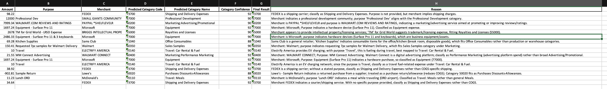

# Expense-Categorizer
Expense management is essential for accounting and audit compliance, but it often consumes significant time with little added value. This project automates the categorization process, reducing manual effort and improving consistency.

Contributor: Palak Gandhi

# The Big Idea
Manually categorizing business expenses is slow, repetitive and incredibly time consuming. This project is intended to automate that process.

The expense categorizer reads an uploaded Excel file of expenses, analyzes the merchant name and purpose, and uses ChatGPT to classfiy each transaction into the correct accounting category.

The output is an excel file with the following new columms:
- Predicted category code
- Category name
- Confidence score
- Final result
- Explanation

The tool is designed for finance and accounting teams in small to medium sized businesses who do not want to spend a bomb on softwares such as Ramp. 

# How It Works
Here are the steps:
1. The user uploads the input data under the data folder titled "expenses_input.xlsx". If the user wants to use different categories, the user would need to upload that too under the data folder titled "categories.xlsx"
2. Python reads the file using pandas
3. Each row is passed to GPT, which then classfies the transaction using a custom set of categories
4. The output is saved in a new Excel sheet under the "Output" folder. 
5. The file automatically open on your computer.
6. The user chooses if they want to delete the output file or not. This is for security purposes.

# Features
* The software understands context with the help of ChatGPT
* Handles Excel and CSV files
* Progress bar to make it visually appealing
* Data showed in .env, so it is not exposed to the public
* Easy to change the categories and logic

# Usage Instructions
### Prepare your input file
The input file must have at least the following columns:
* Merchant 
* Purpose

The user must also ensure that the input files are named correctly:
* Categories: "categories.xlsx"
* Raw expense information: "expenses_input.xlsx"

# Implementation Information

### File Reading
* io_utils.py uses pandas to load CSV and Excel files.

### Classification Logic
In classifier.py:
* Your categories are stored in a dictionary
* GPT received:
- Merchant 
- Purpose
- Category list
- Confidence threshold rules

# Main Pipeline
main.py performs:
1. Load input
2. Validate columns
3. Loop & classify each row
4. Add prediction columns
5. Save output
6. Open output file
7. Ask if user wants to delete it

# Results
Here's an example of what the output should look like:

# Project Evolution
This project changed quite a lot as I worked through it. My original idea was to fully automate the entire expense workflow, and not just categorization, but also assigning category names, switching account numbers depending on the type of expense, and reformatting the final Excel file so it could be uploaded directly into Acumatica (our ERP system).

Once I started building, I realized that doing everything end-to-end within the time constraint wasn’t feasible. So I focused on solving the biggest and most painful part of the process, which was classification. This is the step that normally takes the longest, so improving it provides the most value.

One major improvement I made along the way was adding a progress bar. Early versions printed output after every line, which made the terminal extremely cluttered and slow. The progress bar made the program cleaner, easier to monitor, and much more professional.

# Attribution
This project would not have been possible without the help of a few key people and tools. My supervisor played a big role in helping me understand how expense classification works in our accounting workflow. ChatGPT was essential throughout the process, especially in helping me learn new Python concepts and debugging code as a beginner. Lastly, I want to thank my professor for giving me the freedom to explore a real problem and build something meaningful for the team.

